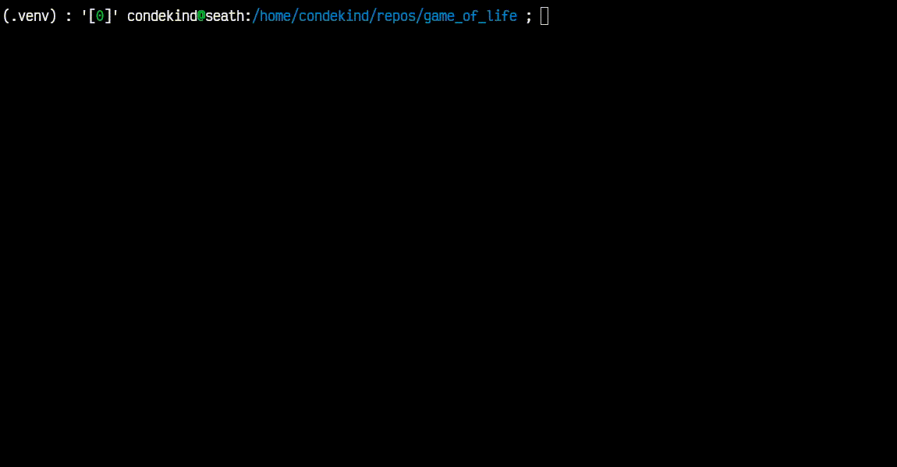

# Game of Life

This is a polars plugin to show and explore some of the things one can achieve by writing plugins.

Polars (and DataFrames in general) were not made for this - it's just a proof of concept.

## Demo

For an example of life running in a dataframe, [see `run.py`](https://github.com/condekind/life_polars_plugin/blob/main/run.py):

```bash
# Assuming requirements have been installed
python run.py -i input/input05.txt -d 0.3
```


